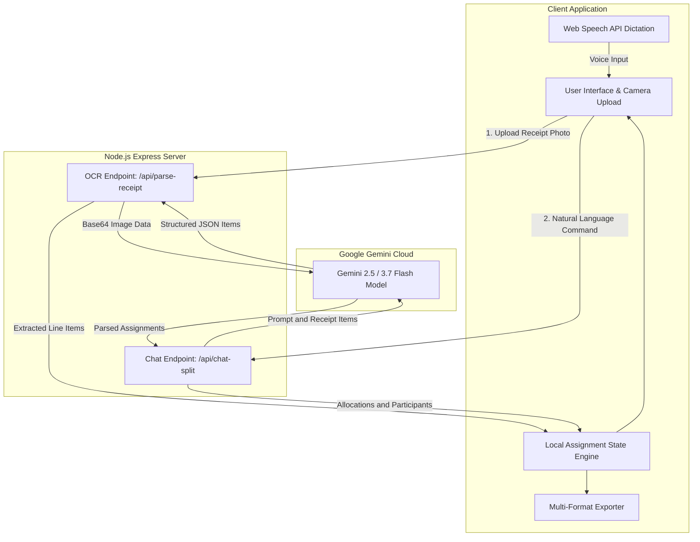

# ReceiptSplit AI — Intelligent Restaurant Bill Splitting Assistant

[](LICENSE)
[](https://www.typescriptlang.org/)
[](https://react.dev/)
[](https://expressjs.com/)
[](https://ai.google.dev/)

> **Split restaurant bills effortlessly with multimodal vision OCR, natural language command assignment, and mathematically exact proportional tax/tip distribution.**

---

## 🎯 The Problem & The Solution

| The Old Way | The ReceiptSplit AI Way |
| :--- | :--- |
| ❌ Manually typing 20 receipt line items and prices into a calculator or notes app. | ✅ **Snap a photo or paste text**: Gemini 3.7 Flash extracts every item, quantity, price, tax, and tip in < 2 seconds. |
| ❌ Doing complex fractions when 3 people shared nachos, 2 shared pizza, and 1 person didn't drink. | ✅ **Talk naturally**: Type or dictate *"Alex had nachos, Sarah & Sue shared pizza 50/50, split drinks across everyone"*. |
| ❌ Flat 50/50 tip splits that force light eaters to subsidize expensive orders. | ✅ **Proportional Tax & Tip Engine**: Calculates each participant's exact tax and tip share relative to their food subtotal. |
| ❌ Clunky signups, logins, and friend requests. | ✅ **Zero friction**: Instant browser-based session with one-click export to WhatsApp, Venmo, CSV, and text. |

---

## 🏗️ Architecture & Data Flow



---

## ✨ Key Features

- **📸 Multimodal Vision Receipt Parsing**: Upload receipt photos (JPG, PNG, WEBP), take a camera photo, or paste raw digital receipt text.
- **🗣️ Natural Language Command Bar**: Assign items conversationally. Supports voice dictation and handles complex splits (unequal percentages, shared items, whole-table splits).
- **📐 Exact Proportional Distribution**:
  $$\text{Person Tax} = \text{Total Tax} \times \left(\frac{\text{Person Subtotal}}{\text{Bill Subtotal}}\right)$$
  $$\text{Person Tip} = \text{Total Tip} \times \left(\frac{\text{Person Subtotal}}{\text{Bill Subtotal}}\right)$$
- **⚡ Live Settlement Summary**: Itemized per-person breakdown with real-time progress bar, unassigned alerts, and mark-as-paid toggles.
- **📤 Multi-Format Export**:
  - **Chat Message**: Cleanly formatted summary ready for WhatsApp, iMessage, and Telegram.
  - **CSV Export**: Spreadsheet-compatible data for record-keeping.
  - **JSON Export**: Raw structured data for integration.
- **🔒 Privacy & Security First**: All Gemini API keys are strictly server-side. Zero permanent storage of personal receipts or credentials.

---

## 🚀 Quick Start

### Prerequisites
- Node.js 18+ or 20+
- A Google Gemini API Key ([Get one free from Google AI Studio](https://aistudio.google.com/app/apikey))

### 1. Clone & Install
```bash
git clone https://github.com/yourusername/receipt-split-ai.git
cd receipt-split-ai
npm install
```

### 2. Configure Environment
Create a `.env` file in the project root:
```env
GEMINI_API_KEY=your_gemini_api_key_here
PORT=3000
NODE_ENV=development
```

### 3. Run Development Server
```bash
npm run dev
```
Open [http://localhost:3000](http://localhost:3000) in your browser.

### 4. Build for Production
```bash
npm run build
npm start
```

---

## 🚢 Deployment

### Render (One-Click / Free Tier)
1. Fork or push this repository to GitHub.
2. Create a new **Web Service** on [Render](https://render.com).
3. Set **Runtime** to `Node`.
4. Set **Build Command**: `npm install && npm run build`
5. Set **Start Command**: `npm start`
6. Add environment variable `GEMINI_API_KEY`.

### Railway / Koyeb
- Detects the `package.json` build and start scripts automatically.
- Ensure `GEMINI_API_KEY` is added to environment variables.

### Docker
```dockerfile
FROM node:20-alpine
WORKDIR /app
COPY package*.json ./
RUN npm install
COPY . .
RUN npm run build
EXPOSE 3000
CMD ["npm", "start"]
```

---

## 📂 Project Structure

```
├── server.ts                 # Express backend & Gemini API endpoints (/api/*)
├── src/
│   ├── App.tsx               # Main layout, view switching & state coordination
│   ├── types.ts              # Core TypeScript interfaces (Receipt, Person, SplitSummary)
│   ├── components/
│   │   ├── Header.tsx        # Top navigation, samples dropdown, people count
│   │   ├── ReceiptPane.tsx   # Receipt line items editor, tax/tip calculator
│   │   ├── ReceiptItemCard.tsx # Line item card with manual & fuzzy assigners
│   │   ├── ChatPane.tsx      # AI natural language command bar & voice input
│   │   ├── SettlementSummary.tsx # Proportional totals, itemized breakdowns
│   │   ├── ReceiptUploader.tsx # Photo drag-and-drop, camera & text parser
│   │   ├── PeopleManagerModal.tsx # Participant color coding & management
│   │   └── ShareModal.tsx    # Multi-format export (Text, CSV, JSON)
│   ├── data/
│   │   └── samples.ts        # Built-in realistic sample receipts
│   └── utils/
│       └── calculator.ts     # Proportional math calculations & text formatting
├── docs/
│   └── ARCHITECTURE.md       # Detailed technical spec & mathematical formulas
├── .env.example              # Template environment variables
└── package.json              # Build scripts and dependencies
```

---

## 🧪 Testing & Verification

Run TypeScript type check and build verification:
```bash
npm run lint
npm run build
```

---

## 📄 License

This project is licensed under the [MIT License](LICENSE).
